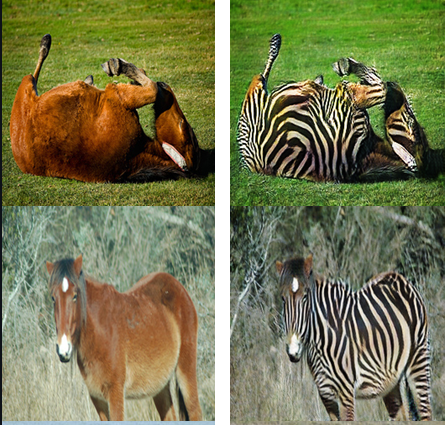

# CycleGAN
A clean, simple and readable implementation of CycleGAN in PyTorch. I've tried to replicate the original paper as closely as possible, so if you read the paper the implementation should be pretty much identical. The results from this implementation I would say is on par with the paper, I'll include some examples results below.

## Results
The model was trained on Zebra<->Horses dataset.

|1st column: Input || 2nd column: Generated |
|:---:|
||
